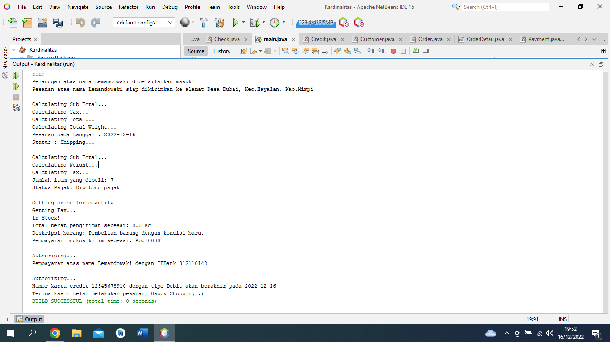

# latihanjava8

## Program Kardinalitas

• Mendeklarasikan <i>class Customer</i>
```java 
import java.util.ArrayList;
import java.util.List;

public class Customer {

    private String name;
    private String address;
    private List<Order> orderList = new ArrayList<Order>();

    public String getName() {
        return name;
    }

    public void setName(String name) {
        this.name = name;
    }

    public String getAddress() {
        return address;
    }

    public void setAddress(String address) {
        this.address = address;
    }

    public void addOrder(Order order) {
        this.orderList.add(order);
    }
}
```

• Mendeklarasikan <i>class Order</i> y
```java 
import java.time.LocalDate;
import java.util.ArrayList;
import java.util.List;

public class Order {
    private LocalDate date;
    private String status;
    private Customer customer;
    private List<Cash> cashList;
    private List<Check> checkList;
    private List<Credit> creditList;
    private List<OrderDetail> orderDetailList;

    public Order() {
        this.cashList = new ArrayList<Cash>();
        this.checkList = new ArrayList<Check>();
        this.creditList = new ArrayList<Credit>();
        this.orderDetailList = new ArrayList<OrderDetail>();
        this.customer = new Customer();
    }

    public LocalDate getDate() {
        return date;
    }

    public void setDate(LocalDate date) {
        this.date = date;
    }

    public String getStatus() {
        return status;
    }

    public void setStatus(String status) {
        this.status = status;
    }

    public void addCashList(Cash cash) {
        this.cashList.add(cash);
    }

    public void addCheckList(Check check) {
        this.checkList.add(check);
    }

    public void addCreditList(Credit credit) {
        this.creditList.add(credit);
    }

    public void addOrderDetail(OrderDetail orderDetail) {
        this.orderDetailList.add(orderDetail);
    }

    public void calcSubTotal() {
        System.out.println("Calculating Sub Total...");
    }

    public void calcTax() {
        System.out.println("Calculating Tax...");
    }

    public void calcTotal() {
        System.out.println("Calculating Total...");
    }

    public void calcTotalWeight() {
        System.out.println("Calculating Total Weight...");
    }
}
```
___
• Mendeklarasikan <i>class OrderDetail</i> 
```java 
public class OrderDetail {
    private int quantity;
    private String taxStatus;
    private Order order;
    private Item item;

    public OrderDetail(Order order) {
        this.order = order;
        this.item = new Item();
    }

    public int getQuantity() {
        return quantity;
    }

    public void setQuantity(int quantity) {
        this.quantity = quantity;
    }

    public String getTaxStatus() {
        return taxStatus;
    }

    public void setTaxStatus(String taxStatus) {
        this.taxStatus = taxStatus;
    }

    public void calcSubTotal() {
        System.out.println("Calculating Sub Total...");
    }

    public void calcWeight() {
        System.out.println("Calculating Weight...");
    }

    public void calcTax() {
        System.out.println("Calculating Tax...");
    }
}
```
• Mendeklarasikan <i>class Item</i> 
```java 
import java.util.ArrayList;
import java.util.List;

public class Item {
    private double shippingWeight;
    private String description;
    private List<OrderDetail> orderDetailList = new ArrayList<OrderDetail>();

    public double getShippingWeight() {
        return shippingWeight;
    }

    public void setShippingWeight(double shippingWeight) {
        this.shippingWeight = shippingWeight;
    }

    public String getDescription() {
        return description;
    }

    public void setDescription(String description) {
        this.description = description;
    }

    public void addOrderDetail(OrderDetail orderDetail) {
        this.orderDetailList.add(orderDetail);
    }

    public void getPriceForQuantity() {
        System.out.println("Getting price for quantity...");
    }

    public void getTax() {
        System.out.println("Getting Tax...");
    }

    public void inStock() {
        System.out.println("In Stock!");
    }
}

```
___
• Mendeklarasikan <i>class Payment</i> sebagai class super class dari class Cash,Credit, dan Check. 
```java 
public class  Payment {
    private float amount;
    private Order order;

    public Payment() {
        order = new Order();
    }
}
```
• Mendeklarasikan <i>class Cash</i> yang merupakan subclass dari <i>class Payment</i>
```java 
public class Cash extends Payment {
    private float cashTendered;

    public float getCashTendered() {
        return cashTendered;
    }

    public void setCashTendered(float cashTendered) {
        this.cashTendered = cashTendered;
    }
}
```
• Mendeklarasikan <i>class Credit</i> yang merupakan subclass dari <i>class Payment</i>
```java 
import java.time.LocalDate;

public class Credit extends Payment {
    private String number;
    private String type;
    private LocalDate expDate;

    public void authorized() {
        System.out.println("Authorizing...");
    }

    public String getNumber() {
        return number;
    }

    public void setNumber(String number) {
        this.number = number;
    }

    public String getType() {
        return type;
    }

    public void setType(String type) {
        this.type = type;
    }

    public LocalDate getExpDate() {
        return expDate;
    }

    public void setExpDate(LocalDate expDate) {
        this.expDate = expDate;
    }
}
```
• Mendeklarasikan <i>class Check</i> yang merupakan subclass dari <i>class Payment</i>
```java 
public class Check extends Payment {
    private String name;
    private String bankID;

    public void authorized() {
        System.out.println("Authorizing...");
    }

    public String getName() {
        return name;
    }

    public void setName(String name) {
        this.name = name;
    }

    public String getBankID() {
        return bankID;
    }

    public void setBankID(String bankID) {
        this.bankID = bankID;
    }
}

```
• Mendeklarasikan <i>class main</i> class main dari program Kardinalitas
```java 
import java.time.LocalDate;

public class main {
    public static void main(String[] args) {

        Customer leman = new Customer();
        leman.setName("Lemandowski");
        leman.setAddress("Desa Dubai, Kec.Hayalan, Kab.Mimpi");
        System.out.println("Pelanggan atas nama " + leman.getName() + " dipersilahkan masuk!");
        System.out.println("Pesanan atas nama " + leman.getName() + " siap dikirimkan ke alamat " + leman.getAddress());

        System.out.println();

        Order kfc = new Order();
        leman.addOrder(kfc);
        kfc.calcSubTotal();
        kfc.calcTax();
        kfc.calcTotal();
        kfc.calcTotalWeight();
        kfc.setDate(LocalDate.now());
        kfc.setStatus("Shipping...");
        System.out.println("Pesanan pada tanggal : " + kfc.getDate());
        System.out.println("Status : " + kfc.getStatus());

        System.out.println();

        OrderDetail detailOrder = new OrderDetail(kfc);
        detailOrder.calcSubTotal();
        detailOrder.calcWeight();
        detailOrder.calcTax();
        detailOrder.setQuantity(7);
        detailOrder.setTaxStatus("Dipotong pajak");
        kfc.addOrderDetail(detailOrder);
        System.out.println("Jumlah item yang dibeli: " + detailOrder.getQuantity());
        System.out.println("Status Pajak: " + detailOrder.getTaxStatus());

        System.out.println();

        Item item = new Item();
        item.getPriceForQuantity();
        item.getTax();
        item.inStock();
        item.setShippingWeight(8);
        item.setDescription("Pembelian barang dengan kondisi baru.");
        item.addOrderDetail(detailOrder);
        System.out.println("Total berat pengiriman sebesar: " + item.getShippingWeight() + " Kg");
        System.out.println("Deskripsi barang: " + item.getDescription());

        Cash cash = new Cash();
        cash.setCashTendered(10000.0F);
        kfc.addCashList(cash);
        System.out.println("Pembayaran ongkos kirim sebesar: Rp." + (int) cash.getCashTendered());

        System.out.println();

        Check check = new Check();
        check.setName("Lemandowski");
        check.setBankID("312110148");
        check.authorized();
        kfc.addCheckList(check);
        System.out.println("Pembayaran atas nama " + check.getName() + " dengan IDBank " + check.getBankID());

        System.out.println();

        Credit credit = new Credit();
        credit.authorized();
        credit.setNumber("12345678910");
        credit.setType("Debit");
        credit.setExpDate(LocalDate.now());
        kfc.addCreditList(credit);
        System.out.println("Nomor kartu credit " + credit.getNumber() + " dengan tipe " + credit.getType() + " akan berakhir pada " + credit.getExpDate());

        System.out.println("Terima kasih telah melakukan pesanan, Happy Shopping :)");
    }
}
```
• Hasil Run



SELESAI
